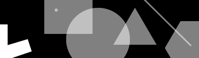

# p5.collide


#### A lightweight 2d & 3d collision library for p5.js

p5.collide contains some versions of, and references to, the functions in [Jeffrey Thompson's Collision Detection Book](http://www.jeffreythompson.org/collision-detection/)

[How to Add a library to your p5.js sketch](https://github.com/processing/p5.js/wiki/Libraries#adding-a-library-to-your-project)

p5.collide assumes the default p5.js rectMode(CORNER) and ellipseMode(CENTER)
<br>All p5.collide functions return true if the specified geometry is colliding and false if they are not.

p5.collide is [MIT licensed](LICENSE.txt)

## Table of Contents
##### Utility
  + [collideDebug()](#collidedebug)

##### 2D Collision Detection
  + [collidePointPoint()](#collidepointpoint)
  + [collidePointCircle()](#collidepointcircle)
  + [collidePointRect()](#collidepointrect)
  + [collideRectRect()](#colliderectrect)
  + [collideCircleCircle()](#collidecirclecircle)
  + [collideRectCircle()](#colliderectcircle)
  + [collidePointLine()](#collidepointline)
  + [collideLineCircle()](#collidelinecircle)
  + [collideLineLine()](#collidelineline)
  + [collideLineRect()](#collidelinerect)


##### 3D Collision Detection
COMING SOON!
  + [collidePointPoint()](#collidepointpoint)
  + [collideBoxBox()](#collideboxbox)
  + [collideBoxSphere()](#collideboxsphere)
  + [collideSphereSphere()](#collidespheresphere)


## p5.collide examples & documentation

#### collideDebug()
######collideDebug(debugMode, size, color)
Enables collision debug mode. Draws an ellipse at the collision point between objects on screen where applicable and calculable. 
+ collideDebug() is applicable to the following:
+ [collideLineCircle()](#collidelinecircle)
+ [collideLineLine()](#collidelineline)
+ [collideLineRect()](#collidelinerect)

```javascript
function setup() {
  collideDebug(true);
}
```

#### collidePointPoint()
###### collidePointPoint((x, y, [z], x2, y2[2Dbuffer],[z2], [3Dbuffer])
Point to point collision in 2d or 3d with an optional buffer zone.

Standard Usage:
+ `collidePointPoint(x,y,x2,y2)` as the most basic collision between two points, no buffer
+ `collidePointPoint(x,y,x2,y2,2Dbuffer)` for collision between two points with a defined buffer
+ `collidePointPoint(x,y,z,x2,y2,z2)` for collision between two 3D points, no buffer
+ `collidePointPoint(x,y,z,x2,y2,z2,3Dbuffer)` for collision between two 3D points with a defined buffer


```javascript
//basic 2D example
var hit = false;
function draw() {
	background(255);
	ellipse(100,100,1,1); //change to 10,10px size for buffer example
	ellipse(mouseX,mouseY,1,1); //change to 10,10px size for buffer example

	//no buffer zone, most standard example
	hit = collidePointPoint(100,100,mouseX,mouseY)

	//buffer of 10 px
	//hit = collidePointPoint(100,100,mouseX,mouseY,10)

	print("colliding? " + hit);
}
```
```javascript
//basic 3D example
var hit = false;
function draw() {
	background(255);
}
```
#### collidePointCircle()
###### collidePointCircle(pointX, pointY, circleX, circleY, diameter)
point to circle collision in 2D. Assumes ellipseMode(CENTER);
```javascript
var hit = false;
function draw() {
	background(255);
	ellipse(200,200,100,100);
	point(mouseX,mouseY);

	hit = collidePointCircle(mouseX,mouseY,200,200,100)

	print("colliding? " + hit);

}
```
#### collidePointRect()
###### collidePointRect(pointX, pointY, x, y, width, height)
point to rect collision in 2D. Assumes rectMode(CORNER);
```javascript
var hit = false;
function draw() {
  background(255);
	rect(200,200,100,150);

	hit = collidePointRect(mouseX,mouseY,200,200,100,150);

	print("colliding? " + hit);

}
```

#### collideCircleCircle()
###### collideCircleCircle(circleX, circleY,circleDiameter, circleX2, circleY2, circleDiameter2)
circle to circle collision in 2D. Assumes ellipseMode(CENTER);

```javascript
var hit = false;
function draw() {
	background(255);
	ellipse(200,200,100,100);
	ellipse(mouseX,mouseY,150,150);

	hit = collideCircleCircle(mouseX,mouseY,150,200,200,100)

	print("colliding? " + hit);

}
```

#### collideRectRect()
###### collideRectRect(x, y, width, height, x2, y2, width2, height2 )
rect rect collision in 2D. Assumes rectMode(CORNER);

```javascript
var hit = false;
function draw() {
  background(255);
	rect(200,200,100,150);
	rect(mouseX,mouseY,50,75);

	hit = collideRectRect(200,200,100,150,mouseX,mouseY,50,75);

	print("colliding? " + hit);

}
```

#### collideRectCircle()
###### collideRectRect(x, y, width, height, x2, y2, width2, height2 )
rect circle collision in 2D. Assumes rectMode(CORNER) && ellipseMode(CENTER);

```javascript
var hit = false;
function draw() {
  background(255);
	rect(200,200,100,150);
	ellipse(mouseX,mouseY,100,100);

	hit = collideRectCircle(200,200,100,150,mouseX,mouseY,100);

	print("colliding? " + hit);
}
```

####collidePointLine()
######collidePointLine(pointX, pointY, x, y, x2, y2, buffer)
point to line collision in 2D, includes and optional buffer which expands the hit zone on the line (default buffer is 0.1).
```javascript
var hit = false;
function draw(){
  background(255);
	line(200,300,100,150);
	point(mouseX,mouseY);

  //collide point line using the optional buffer with a 0.5 value
	hit = collidePointLine(mouseX,mouseY,200,300,100,150, 0.5);

	print("colliding? " + hit);
}
```
####collideLineCircle()
######collideLineCircle(x1,  y1,  x2,  y2,  cx,  cy,  diameter)
point to circle collision in 2D. Has a [debug mode](#collidedebug).
```javascript
var hit = false;
function draw(){
  background(255);
	line(200,300,100,150);
	ellipse(mouseX,mouseY,50,50);
	hit = collideLineCircle(200,300,100,150,mouseX,mouseY,50);

	print("colliding? " + hit);

}
```

####collideLineLine()
######collideLineLine(x1, y1, x2, y2, x3, y3, x4, y4, calcIntersection)
line to line collision in 2D. Takes an optional boolean parameter which calculates the intersection point. If enabled it will return an object containing the x,y position of the collision intersection. If no intersection occurs, it will return an object containing x,y values as false. Has a [debug mode](#collidedebug).

```javascript
//basic example
var hit = false;
function draw(){
  background(255);
  line(200,300,100,150);
  line(mouseX,mouseY,350,50);
  hit = collideLineLine(200,300,100,150,mouseX,mouseY,350,50);

  print("colliding? " + hit);
}
```
```javascript
//Return an object containing the x,y position of the intersection using the optional calcIntersection boolean
var hit = false;
function draw(){
  background(255);
  line(200,300,100,150);
  line(mouseX,mouseY,350,50);

  hit = collideLineLine(200,300,100,150,mouseX,mouseY,350,50,true);

  print("X-intersection:" + hit.x);
  print("Y-intersection:" + hit.y);
}
```

####collideLineRect()
######collideLineRect(x1, y1, x2, y2, rx, ry, rw, rh, calcIntersection)
Line to Rectangle collision in 2d. Takes and optional boolean parameter which calculates the intersection points. If enables it will return an object containing objects of the top,left,bottom,right X,Y intersection positions. If no intersection occurs, it will return an object containing x,y values as false. Has a [debug mode](#collidedebug).

```javascript
//basic example
var hit = false;
function draw() {
	background(255);
	rect(200,300,100,150);
	line(mouseX,mouseY,350,50);

	hit = collideLineRect(mouseX,mouseY,350,50,200,300,100,150);

	print("colliding? " + hit);
}
```

```javascript
//Return an object containing the x,y position of the bottom intersection of the rect using the optional calcIntersection boolean.
var hit = false;
function draw() {
	background(255);
	rect(200,300,100,150);
	line(mouseX,mouseY,350,50);

	hit = collideLineRect(mouseX,mouseY,350,50,200,300,100,150,true);

  //retruned object contains top,right,bottom,left objects which each contain x,y values.
  print("bottomX: " + hit.bottom.x);
  print("bottomY: " + hit.bottom.y);
  print("topX: " + hit.top.x);
  print("topY: " + hit.top.y);
  print("leftX: " + hit.left.x);
  print("leftY: " + hit.left.y);
  print("rightX: " + hit.right.x);
  print("rightY: " + hit.right.y);
}
```


